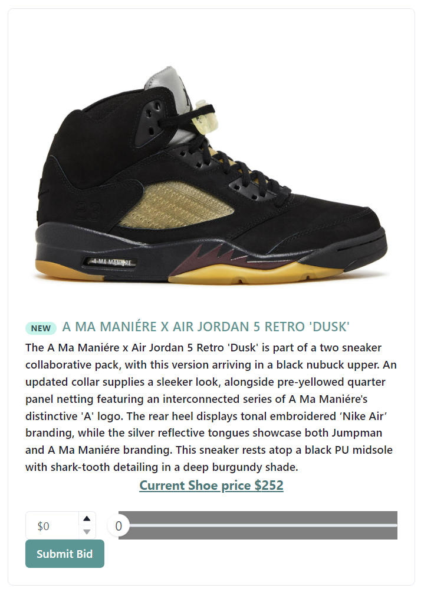

<a name="readme-top"></a>

[![LinkedIn][linkedin-shield]][linkedin-url]


<!-- PROJECT LOGO -->
<br />
<div align="center">
  <a href="https://github.com/skeesen8/Sneaker-App">
    
  </a>

  <h3 align="center">Sneaker App</h3>

  <p align="center">
    Upload, auction and bid on shoes through this full stack app!
    <br />
    <a href="https://github.com/skeesen8/Sneaker-App"><strong>Explore the docs »</strong></a>
    <br />
    <br />
    <a href="https://github.com/skeesen8/Sneaker-App">View Demo</a>
  </p>
</div>


<!-- TABLE OF CONTENTS -->
<details>
  <summary>Table of Contents</summary>
  <ol>
    <li>
      <a href="#about-the-project">About The Project</a>
      <ul>
        <li><a href="#built-with">Built With</a></li>
      </ul>
    </li>
    <li>
      <a href="#getting-started">Getting Started</a>
      <ul>
        <li><a href="#prerequisites">Prerequisites</a></li>
        <li><a href="#installation">Installation</a></li>
      </ul>
    </li>
    <li><a href="#usage">Usage</a></li>
    <li><a href="#roadmap">Roadmap</a></li>
    <li><a href="#contributing">Contributing</a></li>
    <li><a href="#license">License</a></li>
    <li><a href="#contact">Contact</a></li>
    <li><a href="#acknowledgments">Acknowledgments</a></li>
  </ol>
</details>


<!-- ABOUT THE PROJECT -->
## About The Project

[![Product Name Screen Shot][product-screenshot]](https://example.com)

This app was created to allow users to search for and bid on unique and rare shoes to fill their collection.  Users can also list and sell shoes from their personal collection to the highest bidder.  

Core Features:
* User log in to allow for customized experiance and privelage restrictions by user
* Live time bid functionality and reports for users to track when a shoe they are interested on has a competing bid
* Users have admin priveleges to delete their own listings but not others
* Simple and flexible bidding system allows users to bid with custom input or with a slide bar
* Real time updates with new bid prices


<p align="right">(<a href="#readme-top">back to top</a>)</p>


### Built With

* [![React][React.js]][React-url]
* [![Flask][Flask]][Flask-url]
* [![Python][Python.org]][Python-url]
* [![Chakra UI][Chakra.com]][Chakra-url]


<p align="right">(<a href="#readme-top">back to top</a>)</p>


<!-- GETTING STARTED -->
## Getting Started
To get a local copy up and running follow these simple example steps.


### Installation

1.  Clone the repo
   ```sh
   git clone https://github.com/your_username_/Project-Name.git
   ```
3. Install NPM packages
   ```sh
   npm install
   ```
4. CD into Client server 
   ```sh
   cd client
   ```
5. run client 
   ```sh
   npm start
   ```
6. Create new terminal window and CD into Server 
   ```sh
   cd server
   ```
7. run server 
   ```sh
   flask run --port 5555
   ```
7. navigate to web browser and explore webpage 

<p align="right">(<a href="#readme-top">back to top</a>)</p>


<!-- USAGE EXAMPLES -->
## Usage

Use this space to show useful examples of how a project can be used. Additional screenshots, code examples and demos work well in this space. You may also link to more resources.

_For more examples, please refer to the [Documentation](https://example.com)_

<p align="right">(<a href="#readme-top">back to top</a>)</p>


<!-- ROADMAP -->
## Roadmap

- [ ] Add admin page per user to show active bids and any won auctions
- [ ] Add notification system to alert users quickly
- [ ] Add bid reports on each unique shoe page
- [ ] Add payment portal


<p align="right">(<a href="#readme-top">back to top</a>)</p>


<!-- CONTACT -->
## Contact

Sackett Keesen - [@LinkedIn](https://www.linkedin.com/in/sackett-keesen/) - skeesen8@gmail.com

<p align="right">(<a href="#readme-top">back to top</a>)</p>


<!-- ACKNOWLEDGMENTS -->
## Acknowledgments

* [Img Shields](https://shields.io)


<p align="right">(<a href="#readme-top">back to top</a>)</p>


<!-- MARKDOWN LINKS & IMAGES -->
<!-- https://www.markdownguide.org/basic-syntax/#reference-style-links -->
[contributors-shield]: https://img.shields.io/github/contributors/othneildrew/Best-README-Template.svg?style=for-the-badge
[contributors-url]: https://github.com/skeesen8/Sneaker-App/graphs/contributors
[forks-shield]: https://img.shields.io/github/forks/othneildrew/Best-README-Template.svg?style=for-the-badge
[forks-url]: https://github.com/othneildrew/Best-README-Template/network/members
[stars-shield]: https://img.shields.io/github/stars/othneildrew/Best-README-Template.svg?style=for-the-badge
[stars-url]: https://github.com/skeesen8/Sneaker-App/stargazers
[linkedin-shield]: https://img.shields.io/badge/-LinkedIn-black.svg?style=for-the-badge&logo=linkedin&colorB=555
[linkedin-url]: https://www.linkedin.com/in/sackett-keesen/
[product-screenshot]: client/Images/screenshot.png
[React.js]: https://img.shields.io/badge/React-20232A?style=for-the-badge&logo=react&logoColor=61DAFB
[React-url]: https://reactjs.org/
[Flask]: https://img.shields.io/badge/Flask-000000?style=for-the-badge&logo=flask&logoColor=white
[Flask-url]: https://flask.palletsprojects.com/en/3.0.x/
[Python.org]: https://img.shields.io/badge/Python-FFD43B?style=for-the-badge&logo=python&logoColor=blue
[Python-url]: https://www.python.org/
[Chakra.com]: https://img.shields.io/badge/Chakra--UI-319795?style=for-the-badge&logo=chakra-ui&logoColor=white
[Chakra-url]: https://chakra-ui.com/
 

